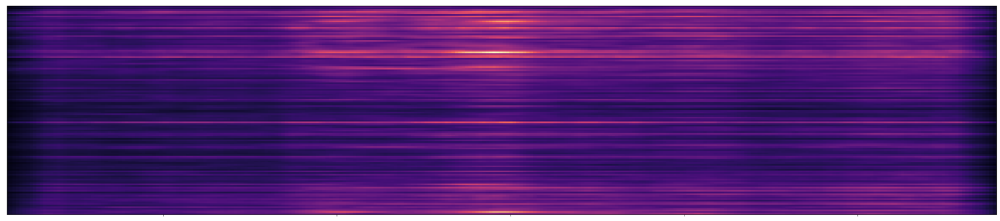
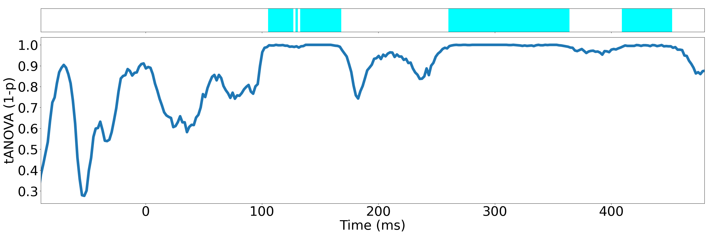
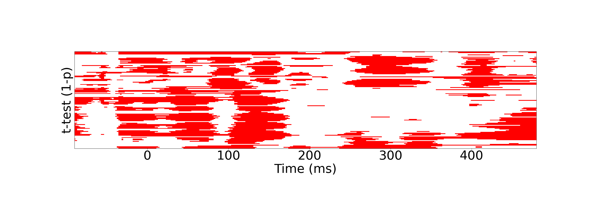

# Probing EEG Signals with Neural-Network Classifiers
This is the repository for our ML Project 2 - Probing EEG Signals with Neural-Network Classifiers.
## Table of Contents
- [Overview](#overview)
- [Prerequisites](#prerequisites)
- [Getting Started](#getting-started)
    - [Data](#data)
    - [Training](#training)
    - [Testing](#testing)
    - [Visualization](#visualization)
    - [Statistic Analysis](#statistic-analysis)
 
## Overview
You can find the codes here for gender classification from EEG data. We implement 4 models, including a linear model (LIN), a multilayer perceptron (MLP), a recurrent model (GRU) and a convolutional model (CNN). 

## Prerequisites
- Python 3
- panda
- openpyxl
- numpy
- collection
- matplotlib 2.1.1
- scipy 1.7.1
- PyTorch 1.7.1 
- imageio
- opencv

Other versions may also work.

## Getting Started
### Data
Before running the code, you need to download the dataset from [EEG_dataset.pth](https://drive.google.com/file/d/1zQi72b9_j1zbEUPtQorYEv29_3OLVOe6/view?usp=sharing) and [EEG_dataset_by_subject.pth](https://drive.google.com/file/d/1Y5UCXA82ko64fAdmeH0Kn4C2-EN-tVJJ/view?usp=sharing) and put them under `./data/training_data`. You also need to download our pretrained models from here and unzip them to `./checkpoints`.

The difference between `EEG_dataset.pth` and `EEG_dataset_by_subject.pth` is the way how we create the folds for cross validation. EEG_dataset.pth is used for training/testing on the data from the same distribution, while EEG_dataset_by_subject.pth is used for training/testing on the data from different distribution (cross-subject evaluation) which is harder. See Sec. B of the Appendices in our paper for more descriptions of the two different settings.

You should have files organized in the following directories:
```
./data
|--Biosemi128OK.xyz 
|--xyz.npy
|--training_data
   |--EEG_dataset.pth
   |--splits.pth
   |--EEG_dataset_by_subject.pth
   |--splits_by_subject.pth

./checkpoints
|--LIN
   |--random
      |--LIN_split_X_best.pth
   |--by-subject
      |--LIN_split_X_best.pth
|--MLP
   |--random
      |--MLP_split_X_best.pth
   |--by-subject
      |--MLP_split_X_best.pth
|--GRU
   |--random
      |--GRU_split_X_best.pth
   |--by-subject
      |--GRU_split_X_best.pth
|--CNN
   |--random
      |--CNN_split_X_best.pth
   |--by-subject
      |--CNN_split_X_best.pth
```

### Training
To train the classifier on `./data/training_data/EEG_dataset.pth` and `./data/training_data/EEG_dataset_by_subject.pth`, run the following lines respectively.
```
python  main.py --classifier CLASSIFIER_NAME --train_mode full --split_num SPLIT_NUMBER --eeg_dataset ./data/training_data/EEG_dataset.pth --splits_path ./data/training_data/splits.pth --save_model 
python  main.py --classifier CLASSIFIER_NAME --train_mode full --split_num SPLIT_NUMBER --eeg_dataset ./data/training_data/EEG_dataset_by_subject.pth --splits_path ./data/training_data/splits_by_subject.pth --save_model 
```

The default optimizer is Adam optimizer, the learning rate is 0.001, the batch size is 128, and the number of epoch is 100 (but you can change them by setting command-line arguments). If you do not want to save the trained model, drop **--save_model** (the test accuracy will be printed on the screen anyway). Otherwise, the trained model will be saved at `./checkpoints` automatically and be named in the format as `CNN_split_X_best.pth`. For more information of options, check `./lib/options.py`.

### Testing
To test the classifier, run
```
python  eval.py --classifier CLASSIFIER_NAME --train_mode full --load_path PATH_TO_CHECKPOINTS --eeg_dataset PATH_TO_EEG_DATA --splits_path PATH_TO_SPLIT_FILE
```

The script will load models trained on different folds from `PATH_TO_CHECKPOINTS` to evaluate on the test set. The test accuracy will be shown on the screen.

For example, if you want to use our pretrained CNN models for evaluation, you can run
```
python  eval.py --classifier CNN --train_mode full --load_path ./checkpoints/CNN/random --eeg_dataset ./data/training_data/EEG_dataset.pth --splits_path ./data/training_data/splits.pth
python  eval.py --classifier CNN --train_mode full --load_path ./checkpoints/CNN/by-subject --eeg_dataset ./data/training_data/EEG_dataset_by_subject.pth --splits_path ./data/training_data/splits_by_subject.pth
```
The models in `./checkpoints/CNN/random` and `./checkpoints/CNN/by-subject` are trained on `./data/training_data/EEG_dataset.pth` and `./data/training_data/EEG_dataset_by_subject.pth` respectively. After the evalution of our pretrained models, you should get the following results which are reported in our paper.

<table>
<tr><th>EEG_dataset </th><th>EEG_dataset_by_subject</th></tr>
<tr><td>
  
| Model | LIN | MLP | GRU | CNN |                     
|:-----------:|:---:|:---:|:---:|:---:|
| ACC         |76.0%|80.1%|85.5%|90.0%|  

</td><td>
  
| Model | LIN | MLP | GRU | CNN |
|:-----------:|:---:|:---:|:---:|:---:|
| ACC         |55.5%|53.5%|58.5%|66.3%|

</td></tr> </table>


### Visualization
To generate the significance map that indicates in which channels and time periods the signals of female and male have dissimilarities, run
```
python generate_guided_backprop.py --load_path checkpoints/CNN/random --gif 
```
This will give you the following figure and gif. If you do not want to generate gif as it will take a lot of time, drop **--gif**. The left and right images in the gif are 
the temporal amplitude changes of female's and male's signals. In the middel is our corresponding significance map.
<p align="center">
  
</p>

<p align="center">
  
</p>

### Statistic Analysis
We also provide the code for the statistic analysis introduced in our paper.

* For tANOVA analysis, run
  ```
  python statistic_analysis.py --analysis tANOVA --fig_path ./figs
  ```
  You will have the following figure showing the p-value at each time point.
  <p align="center">
  
</p>

* For t-test analysis, run
  ```
  python statistic_analysis.py --analysis ttest --fig_path ./figs
  ```
  You will have the following figure showing the p-value for each channel at every time point.
  <p align="center">
  
</p>

* For behavioral analysis, run
  ```
  python statistic_analysis.py --analysis htest
  ```
  You will have the results as shown in the following table.
  | | Female | Male | Kruskal-Wallis Test |                     
  |:---:|:---:|:---:|:---:|
  | Accuracy           |0.839(0.079)|0.837(0.067)| 0.819|  
  | Reaction Time (ms) |943.8(128.6)|962.7(127.0)| 0.503|  

